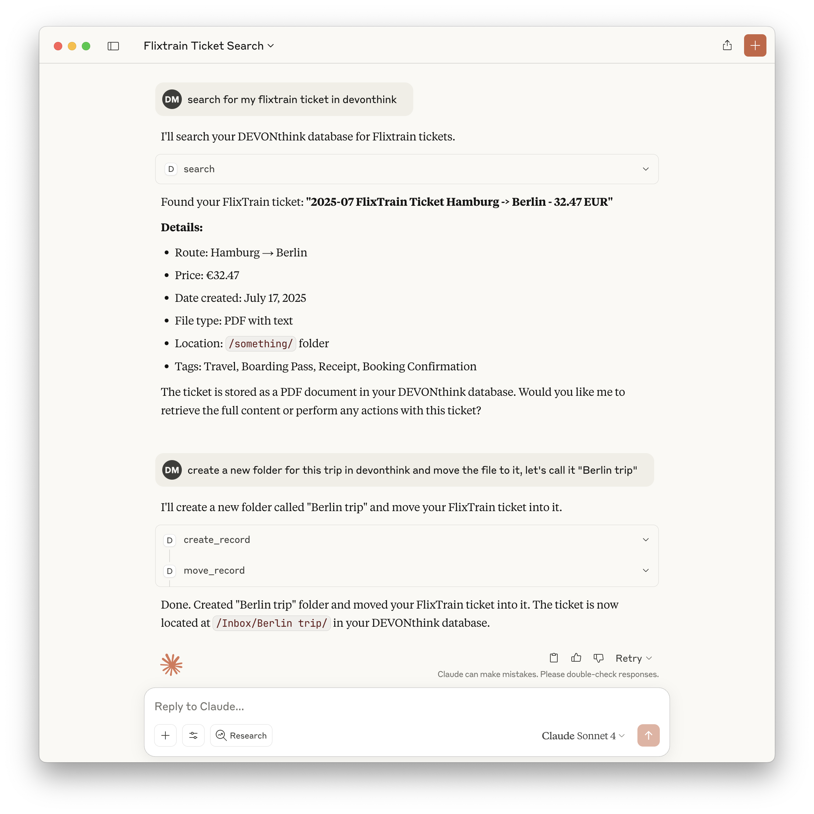

# Devonthink MCP Server

This MCP server provides access to DEVONthink functionality via the Model Context Protocol (MCP). It enables listing, searching, creating, modifying, and managing records and databases in DEVONthink Pro on macOS.



## Features

- Exposes a comprehensive set of DEVONthink operations as MCP tools
- List, search, and look up records by various attributes
- Create, delete, move, and rename records and groups
- Retrieve and modify record content, properties, and tags
- Create records from URLs in multiple formats
- List open databases and group contents
- Resolve Zotero metadata for DEVONthink attachments via Zotero exports
- All tools are type-safe and validated with Zod schemas

## Tools

### Core Tools

1. `is_running`

   - Checks if DEVONthink is currently running
   - No input required
   - Returns: `{ "success": true | false }`

2. `create_record`

   - Creates new records (notes, bookmarks, groups) with specified properties
   - Input: record type, name, parent group, and optional metadata

3. `delete_record`

   - Deletes records by ID, name, or path
   - Input: record identifier

4. `move_record`

   - Moves records between groups
   - Input: record ID and destination group

5. `get_record_properties`

   - Retrieves detailed metadata and properties for records
   - Input: record identifier

6. `search`

   - Performs text-based searches with various comparison options
   - Input: query string and search options

7. `lookup_record`

   - Looks up records by filename, path, URL, tags, comment, or content hash (exact matches only)
   - Input: lookup type and value

8. `create_from_url`

   - Creates records from web URLs in multiple formats
   - Input: URL and format options

9. `get_open_databases`

   - Lists all currently open databases
   - No input required

10. `list_group_content`

    - Lists the content of a specific group
    - Input: group identifier

11. `get_record_content`

    - Retrieves the content of a specific record
    - Input: record identifier

12. `rename_record`

    - Renames a specific record
    - Input: record ID and new name

13. `add_tags`

    - Adds tags to a specific record
    - Input: record ID and tags

14. `remove_tags`

    - Removes tags from a specific record
    - Input: record ID and tags

15. `classify`

    - Gets classification proposals for a record using DEVONthink's AI
    - Input: record UUID, optional database name, comparison type, and tags option
    - Returns: Array of classification proposals (groups or tags) with scores

16. `compare`
    - Compares records to find similarities (hybrid approach)
    - Input: primary record UUID, optional second record UUID, database name, and comparison type
    - Returns: Either similar records (single mode) or detailed comparison analysis (two-record mode)

17. `get_zotero_metadata`
    - Resolves Zotero metadata for a DEVONthink record or Finder path
    - Input: Finder path, record UUID, DEVONthink ID + database, or DEVONthink location path
    - Returns: Matched Zotero item data from JSON or BibTeX export, plus lookup diagnostics

### Example: Search Tool

```json
{
  "query": "project plan",
  "comparison": "contains",
  "database": "Inbox"
}
```

Returns:

```json
{
  "results": [
    { "id": "123", "name": "Project Plan", "path": "/Inbox/Project Plan.md" }
  ]
}
```

## Usage with Claude

Add to your Claude configuration:

```json
{
  "mcpServers": {
    "devonthink": {
      "command": "npx",
      "args": ["-y", "mcp-server-devonthink"]
    }
  }
}
```

## Implementation Details

- Uses JXA (JavaScript for Automation) to control DEVONthink via AppleScript APIs
- All tool inputs are validated with Zod schemas for safety and clarity
- Returns structured JSON for all tool outputs
- Implements robust error handling for all operations
- Includes comprehensive tests using Vitest

See [CLAUDE.md](./CLAUDE.md) for full documentation, tool development guidelines, and API reference.

## Zotero Metadata Lookup

Zotero attachments stored in DEVONthink can be matched to exported Zotero metadata. The MCP server inspects both JSON and BibTeX exports and prefers JSON when both are present.

1. Export your Zotero library (or a subset) to `bibliography.json` and/or `bibliography.bib`.
2. Point the server at the exports via environment variables before launching it (using Claude's MCP configuration or your shell):

   ```bash
   export ZOTERO_BIBLIOGRAPHY_JSON="/path/to/bibliography.json"   # optional
   export ZOTERO_BIBLIOGRAPHY_BIB="/path/to/bibliography.bib"     # optional
   ```

   - Supplying only one file is fine—the server detects whether you provided a `.json` or `.bib` path and uses it automatically.
   - If no metadata file is configured, the tool returns an informative error so you can correct the setup.

3. Call the `get_zotero_metadata` tool with a Finder path or any supported DEVONthink identifier. The tool returns the matched Zotero entry (including citation key, fields, and the property that matched) or detailed errors describing which files were checked.

Example invocation:

```json
{
  "uuid": "7F8C5A5B-1234-5678-ABCD-9876543210EF"
}
```
